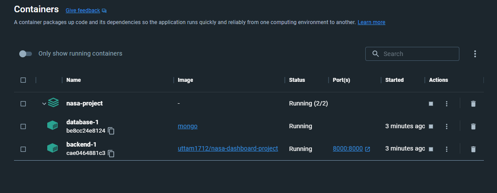
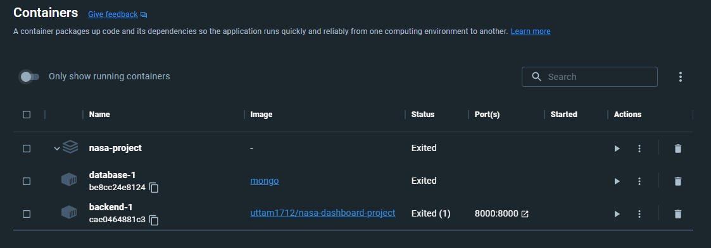
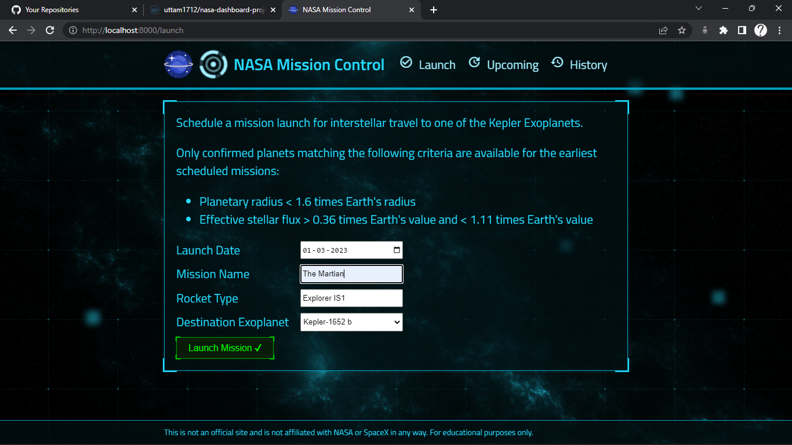
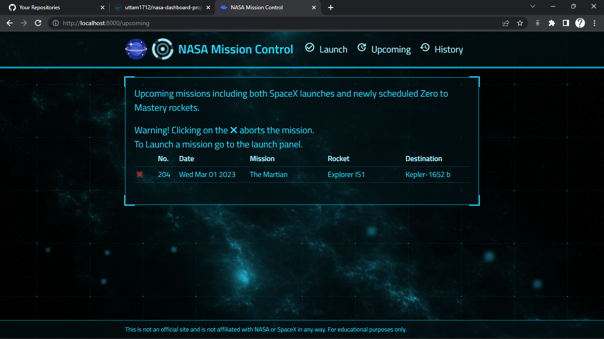
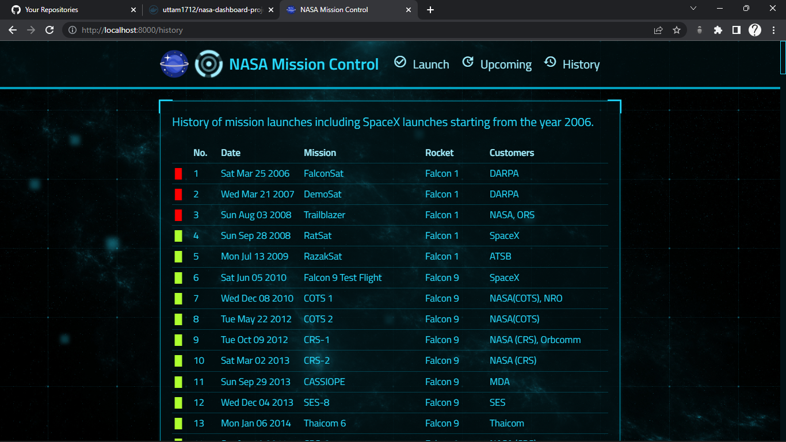
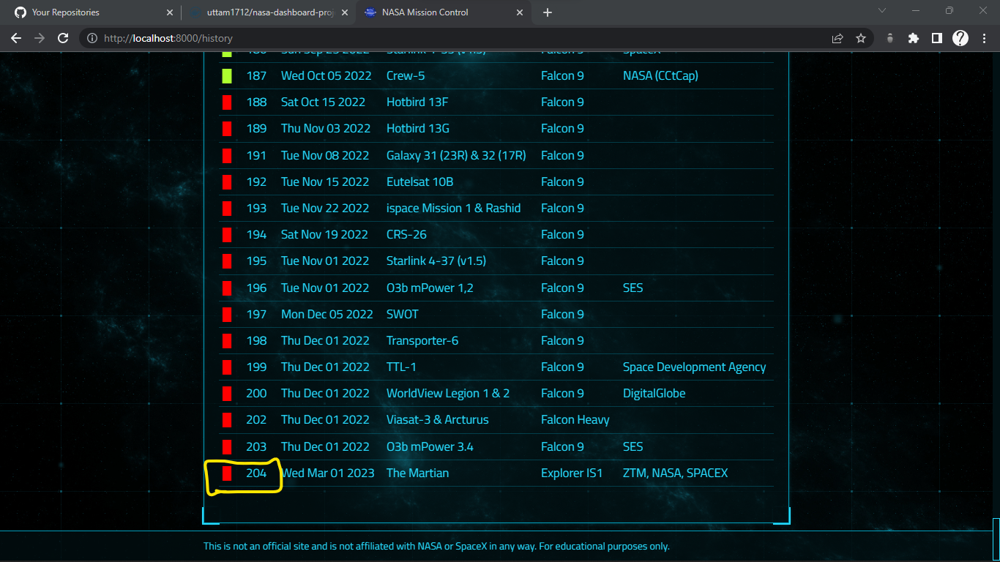

# Nasa mission control dashboard (with MERN stack)

Advanced backend development practice performed by building this small featured full-stack MERN app.

## Steps to run app

_\*\*You need to have docker installed in your machine, mongodb & node.js are not required_

-   #### Clone the github repo and cd into it

```
git clone https://github.com/uttamsutariya/nasa-mission-control-dashboard.git
```

-   #### Pull docker image from docker hub

```
docker pull uttam1712/nasa-dashboard-project:latest
```

-   #### Run docker container by using docker-compose

```
docker compose up -d
```



-   #### To stop all running containers

```
docker compose stop
```



-   #### To stop & remove all running containers

```
docker compose down -v
```

## Screenshots

-   ### Home page (Launch page)

It shows launch page to schedule new launch.
By default all planet data is gathered from [here 🔗](https://exoplanetarchive.ipac.caltech.edu/cgi-bin/TblView/nph-tblView?app=ExoTbls&config=koi), analyzed & streamed habitable planets data which is displayed in dropdown list of Destination Exoplanet.



-   ### Upcoming page

It displays all the new schedled missions from our launch dashboard. From here we can also abort the mision by clicking abort icon. And it will remove from the upcoming list.



-   ### History page

This page shows thehistory of all mission planned by [SpaceX](https://www.spacex.com/). I used [https://api.spacexdata.com/v4/launches/query](https://api.spacexdata.com/v4/launches/query) api to fetch the official data of SpaceX. And that's mapped to my own database.



To view the aborted launch mission that we have done from upcoming page, go to the end of the page, it will show that.



## Folder structure

```shell
.dockerignore
.github
|-- workflows
| |-- ci.yml
Dockerfile
client
|-- .gitignore
|-- package-lock.json
|-- package.json
|-- public
| |-- favicon.png
| |-- img
| | |-- background-large.jpg
| | |-- background-medium.jpg
| | |-- background.jpg
| | |-- glow.png
| |-- index.html
| |-- manifest.json
| |-- robots.txt
| |-- sound
| | |-- abort.mp3
| | |-- click.mp3
| | |-- deploy.mp3
| | |-- success.mp3
| | |-- typing.mp3
| | |-- warning.mp3
|-- src
| |-- App.js
| |-- components
| | |-- Centered.js
| | |-- Clickable.js
| | |-- Footer.js
| | |-- Header.js
| |-- hooks
| | |-- requests.js
| | |-- useLaunches.js
| | |-- usePlanets.js
| |-- index.js
| |-- pages
| | |-- AppLayout.js
| | |-- History.js
| | |-- Launch.js
| | |-- Upcoming.js
| |-- settings.js
package-lock.json
package.json
server
|-- .gitignore
|-- data
| |-- kepler_data.csv
|-- package-lock.json
|-- package.json
|-- src
| |-- app.js
| |-- models
| | |-- launches.model.js
| | |-- launches.schema.js
| | |-- planets.model.js
| | |-- planets.schema.js
| |-- routes
| | |-- api_v1.js
| | |-- launches
| | | |-- launches.controller.js
| | | |-- launches.router.js
| | | |-- launches.test.js
| | |-- planets
| | | |-- planets.controller.js
| | | |-- planets.router.js
| |-- server.js
| |-- services
| | |-- mongo.js
| | |-- query.js
```
